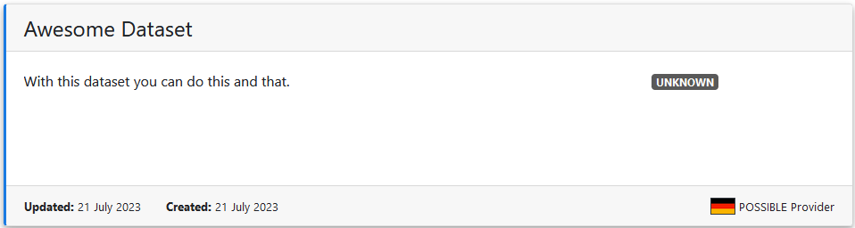
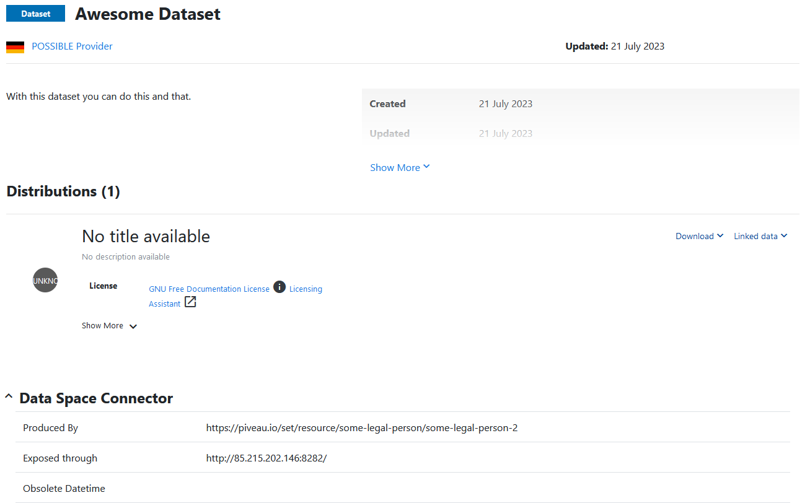

# POSSIBLE Extension

This document explains how to run POSSIBLE-X Extension and send data to the FOKUS Catalog.

## Requirements

- java 17
- gradle

## Steps
### Checkout the repo

- Checkout this repository
```
git clone  https://github.com/POSSIBLE-X/hackathon4.git
```

### Compiling

- go to your `POSSIBLE-X Extension` folder and execute the following:
```
./gradlew build
```

### Edit config file

- Open the `connector/resources/config.properties` file and edit the following fields:  

| Field name                      | Description                                                      |
|---------------------------------|------------------------------------------------------------------|
| `possible.catalog.jwt.token`    | Authorization token to access the Possible-X Catalog     |
| `possible.catalog.endpoint`     | Endpoint of the Possible-X Catalog for the SD registration |
| `possible.connector.edcVersion` | Version of the Connector  |

### Running

- Execute the following command:
```
java -Dedc.fs.config=connector/resources/config.properties  -jar connector/build/libs/connector.jar
```  
Note: This will execute the `Connector`and the `POSSIBLE-X Extension`.

### Interacting

- Execute the following curls in order to create the EDC contract and send the data to the FOKUS Catalog
1) Creation of the Asset
```
curl -d '{
           "@context": {
             "edc": "https://w3id.org/edc/v0.0.1/ns/"
           },
           "asset": {
             "@id": "hackathon4Dataset",
             "properties": {
               "name": "Awesome Dataset",
               "description": "With this dataset you can do this and that",
               "contenttype": "application/json"
             }
           },
           "dataAddress": {
             "type": "IonosS3",
             "account": "edcionosstorage",
             "container": "src-container",
             "blobname": "device1-data.csv",
             "keyName" : "dataset-key"
           }
         }' \
  -H 'X-API-Key: password' -H 'content-type: application/json' http://localhost:8182/management/v2/assets
```

2) Creation of the Policy
```
curl -d '{
           "@context": {
             "edc": "https://w3id.org/edc/v0.0.1/ns/",
             "odrl": "http://www.w3.org/ns/odrl/2/"
           },
           "@id": "aPolicy",
           "policy": {
             "@type": "set",
             "odrl:permission": [],
             "odrl:prohibition": [],
             "odrl:obligation": []
           }
         }' \
  -H 'X-API-Key: password' -H 'content-type: application/json' http://localhost:8182/management/v2/policydefinitions
```

3) Creation of the Contract
```
curl -d '{
           "@context": {
             "edc": "https://w3id.org/edc/v0.0.1/ns/"
           },
           "@id": "contractId",
           "accessPolicyId": "aPolicy",
           "contractPolicyId": "aPolicy",
           "assetsSelector": [
              {"operandLeft":"https://w3id.org/edc/v0.0.1/ns/id", "operator":"=", "operandRight":"hackathon4Dataset"}
           ]
         }' \
  -H 'X-API-Key: password' -H 'content-type: application/json' http://localhost:8182/management/v2/contractdefinitions
```
- After executing the previous curl, the `POSSIBLE-X Extension` will automatically send the data to the FOKUS Catalog. You can now access the [FOKUS Catalog](https://possible.fokus.fraunhofer.de/datasets?locale=en) and and see if the dataset was uploaded. You will have figure similar to the following:

  


- Please note that the URIref contains the `hackathon4Dataset` that was inserted in the first curl command.

- To delete the Dataset from the FOKUS Catalog you can use the `postman` folder. Don't forget to point to the right `asset id`.
